# ReSee — Universal Data Model & Database Architecture

A single, authoritative map of every table across ReSee's ten product
domains — what exists today in Supabase Postgres, how it relates, and
what a mature RBAC, Notifications, and Analytics layer needs to look like
next. This is documentation, not a migration — nothing here has been
applied to the database beyond what's already in
`website/supabase/migrations/`.

**Status legend:** 🟢 Shipped in production · 🟡 Proposed extension

---

## Architecture Principles

- **UUID primary keys, everywhere** — Every table uses `uuid primary key
  default gen_random_uuid()`. No sequential integers.
- **Catalog vs. user-data shape** — Catalog tables (courses,
  practice_topics, interview_sets, jobs, subscription_plans) are
  public-read, admin/seed-written. User-data tables are own-row RLS,
  always carrying a denormalized `user_id` even where a join could
  derive it.
- **JSONB for flexible, single-owner content** — Resume content, quiz
  options/answers, and attempt snapshots use JSONB rather than
  normalized child tables. Normalize when many rows reference the shape;
  use JSONB when one row owns a flexible document nobody else queries
  into.
- **No hard deletes on history** — Attempt logs, quiz attempts, and
  career score history are insert-only or update-in-place-then-frozen.
  Where deletion exists (`saved_jobs`, `practice_bookmarks`,
  `interview_attempts`), it is an explicit product requirement, not a
  default.

---

## Master ERD

Domain hubs radiating from `auth.users`. Each edge is expanded into full
column detail in its domain section below.

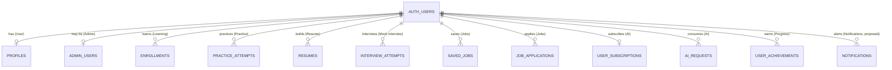

---

## 🟢 User & Identity

Every other domain hangs off `auth.users` (Supabase-managed) and its 1:1
companion, `profiles`. There is no separate roles/permissions system yet
— see Admin & CMS for that proposal.

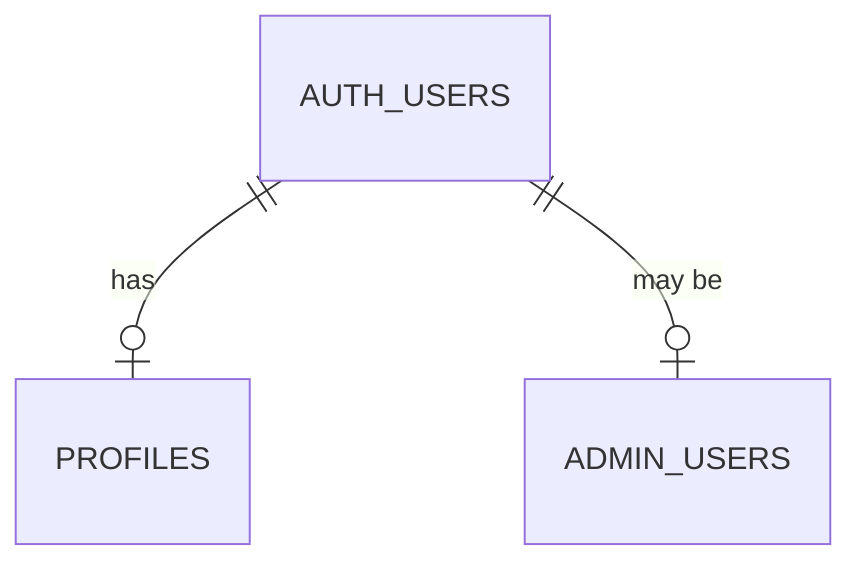

**auth.users** — Supabase-managed. Holds `id`, `email`, hashed
credentials, provider metadata.

**profiles** — 1:1 with auth.users.

| Column | Type | Notes |
|---|---|---|
| id (PK) | uuid | = auth.users.id |
| goal | text | onboarding step 1 |
| skill_level | text | onboarding step 2 |
| target_career | text | free-text career goal |
| role_type | text | fresher / experienced — drives resume template selection |
| current_streak / longest_streak | int | daily-activity streak |
| last_activity_date | date | streak bookkeeping |
| total_learning_minutes | int | lifetime counter |
| education, experience, current_skills, dream_company, dream_salary, interests | jsonb / text | legacy pre-pivot columns — still read defensively by the AI Context Engine, no longer written by current onboarding |

RLS: `select own`, `update own`.

**admin_users** — 1:1 optional.

| Column | Type | Notes |
|---|---|---|
| id (PK) | uuid | |
| user_id (FK) | uuid | unique, references auth.users |
| role | text | check: super_admin / admin / content_manager |
| created_at | timestamptz | |

RLS: **select own only** — no insert/update/delete policy for any
authenticated role; admin grants happen exclusively via the service-role
client from a trusted server context. Existence of a row = is-an-admin;
`role` is a flat checked string, not a normalized table — see Admin & CMS
for the proposed upgrade.

---

## 🟢 Learning

Structured courses → modules → lessons/quizzes, with per-user progress
tracked at each level.

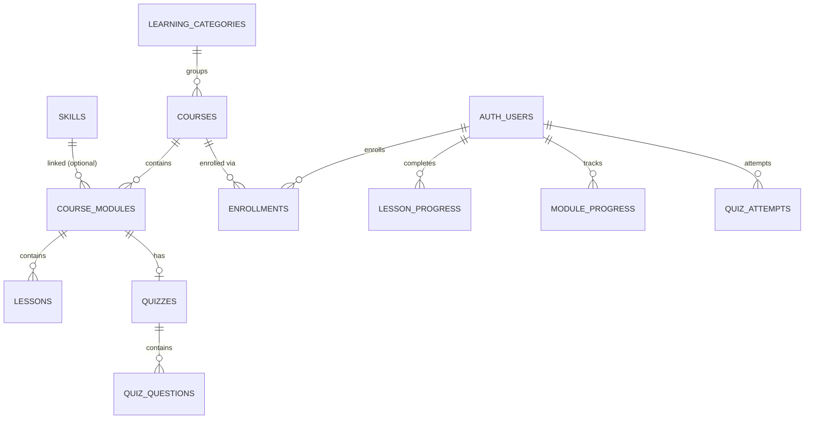

**courses** (catalog, public-read)

| Column | Type | Notes |
|---|---|---|
| id (PK) | uuid | |
| slug | text | unique |
| category_id (FK) | uuid | → learning_categories |
| title, tagline, description | text | |
| difficulty | text | beginner / intermediate / advanced |
| is_available | bool | Coming Soon gate |
| status | text | draft / published / archived (Admin CMS) |
| banner_url, thumbnail_url, tags | text / text[] | Admin CMS additions |

`course_modules → lessons / quizzes → quiz_questions` — standard 3-deep
catalog hierarchy: `course_modules(course_id, sort_order)`
unique-ordered, `lessons` carry `video_url`/`pdf_url`/`notes`/
`attachments jsonb` (Admin CMS additions), `quiz_questions` carries
`correct_option_ids` and has **zero select policy** — read only via the
service-role client so answers never reach the browser.

**User progress (own-row)**

| Table | Key columns | Notes |
|---|---|---|
| enrollments | user_id, course_id (unique), last_lesson_id, last_activity_at | 1 row per user per course |
| lesson_progress | user_id, lesson_id (unique), completed_at | insert-only completion log |
| module_progress | user_id, module_id (unique), lessons_completed_count, quiz_passed, quiz_best_score | mutable running tally |
| quiz_attempts | user_id, quiz_id, score, passed, answers jsonb | insert-only, one row per submit |

RLS: `select own`, `insert own`, `update own` (enrollments,
module_progress).

---

## 🟢 Practice & Assessment

Topic-based question drilling plus timed mock tests, sharing one question
bank.

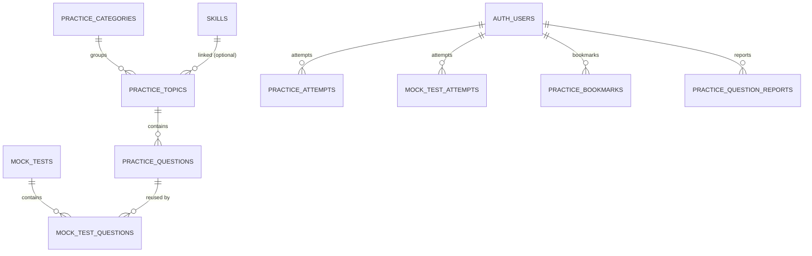

**practice_attempts** — mutable in-progress row

| Column | Type | Notes |
|---|---|---|
| id (PK) | uuid | |
| user_id, topic_id (FK) | uuid | |
| status | text | in_progress / completed |
| question_ids | jsonb | snapshotted order at session start |
| answers | jsonb | autosaved as the user answers |
| correct_count, score, time_taken_seconds | int | set on completion |

Partial unique index `(user_id, topic_id) where status='in_progress'`
enforces exactly one resumable attempt per topic — this is what powers
"Continue Practice." `mock_test_attempts` mirrors this shape exactly for
full mock tests.

Other tables: `practice_questions` (zero select policy, same
answer-protection pattern as `quiz_questions`); `mock_test_questions`
(join table, safe to be public-read); `practice_bookmarks` (the one table
in this domain with a real **delete** policy — toggle-off, unique
`(user_id, question_id)`); `practice_question_reports` (append-only
"report a question" log, insert+select own, no admin review UI yet).

---

## 🟢 Resume Builder

A single flexible-content resume per version chain — no template catalog
table (template selection is app logic), no archive status (removed in
the wizard-based redesign).

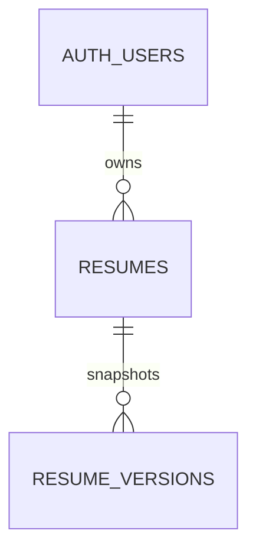

**resumes**

| Column | Type | Notes |
|---|---|---|
| id (PK) | uuid | |
| user_id (FK) | uuid | |
| template_slug | text | check: modern / ats-friendly — no FK; template catalog table was dropped, app-selected via `lib/resumeTemplateSelection.ts` |
| title | text | re-derived from content.personalInfo.fullName on every save |
| content | jsonb | fixed shape: personalInfo, education[], experience[], projects[], skills[], certifications[] |

**resume_versions** — full-content snapshot per throttled save. No
`user_id` column — RLS is enforced via an `exists` subselect against the
parent `resumes` row instead.

RLS: `select/insert/update/delete own` (resumes); `select/insert own via
parent exists()` (resume_versions).

---

## 🟢 Mock Interview

Category × Role × Experience-level bookable sets, each with open-ended
questions and no single "correct answer" — deliberately no AI grading
yet.

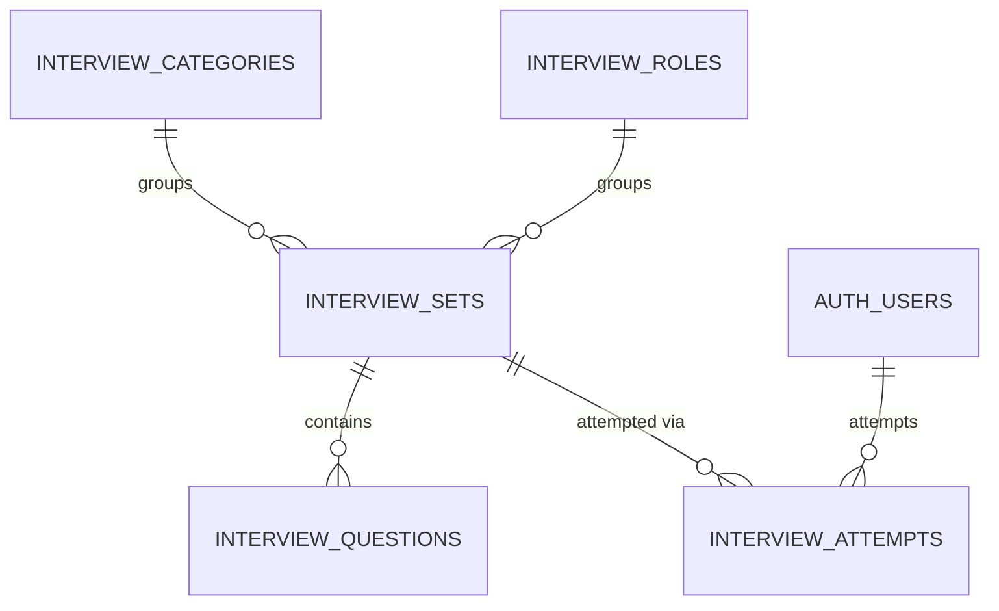

**interview_sets**

| Column | Type | Notes |
|---|---|---|
| id (PK) | uuid | |
| category_id, role_id (FK) | uuid | |
| experience_level | text | check: fresher / 1-3-years / 3-5-years / 5-plus-years |
| is_available | bool | a role is never itself unavailable — availability lives entirely on the set |
| | | unique (category_id, role_id, experience_level) |

`interview_questions.question_type` checks `short_text` / `long_text`
with an explicit `-- future: 'voice', 'video'` comment — the seam for
richer answer modes already exists in the schema.

RLS: `interview_questions` public-read (open-ended, no answer key to
protect); `interview_attempts` select/insert/update/**delete** own — the
only attempt table across the app with a real delete policy, since
"Delete Interview History" is an explicit product requirement here.

---

## 🟢 Jobs & Career Hub

A browsable job board plus per-user saves, applications (Kanban-tracked),
and preferences.

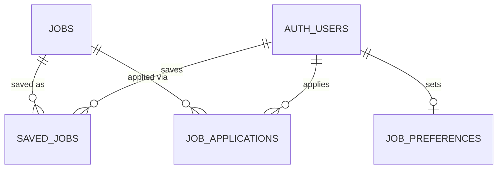

**jobs**

| Column | Type | Notes |
|---|---|---|
| id (PK) | uuid | |
| company | text | free-text — no companies catalog table yet, see Future Recommendations |
| role_slug | text | aligned to interview_roles.slug vocabulary, not FK'd |
| work_mode, job_type | text | checked enums |
| experience_level | text | same 4-bucket taxonomy as interview_sets |
| experience_min_years, experience_max_years, salary_min, salary_max | int | continuous values kept alongside the bucket |
| skills, responsibilities, eligibility | text[] | |

**job_applications** — no delete policy. Status enum `applied →
interview_scheduled → offer_received / rejected → archived`. `archived`
is an explicit terminal status, making delete redundant by design. Unique
`(user_id, job_id)`.

RLS: `jobs` public-read; `saved_jobs`/`job_preferences` select+insert+
update+delete own; `job_applications` select+insert+update own, no
delete.

---

## 🟢 AI Platform

Subscription/credits, request logging, response caching, and a User
Context Engine memory cache. Built as a service layer — no page or route
calls it yet. Full detail in `docs/architecture/ai-architecture.md`.

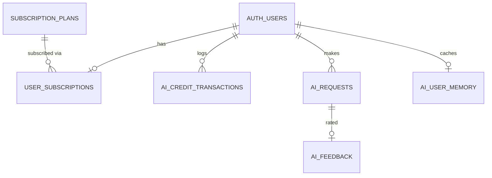

**user_subscriptions** — select-own only

| Column | Type | Notes |
|---|---|---|
| user_id (PK) | uuid | |
| plan_slug (FK) | text | → subscription_plans, default 'free' |
| credits_remaining | int | null = unlimited; every change also writes an ai_credit_transactions row |

No insert/update policy exists — every credit mutation goes through
`lib/ai/credits.ts` using the service-role client.

- `ai_requests` — one row per call: feature, provider, model, status,
  token counts, latency. Doubles as the sliding-window source for rate
  limiting.
- `ai_response_cache` — cache_key (hash of feature+context+params) →
  cached response, TTL-expired. Zero RLS select policy, service-role
  only.
- `ai_user_memory` — a refresh-on-stale (24h) cache of the User Context
  Engine's output. Not chat history.
- `ai_feedback` — thumbs up/down per request, unique
  `(ai_request_id, user_id)`.

---

## 🟢🟡 Progress & Analytics (core shipped, rollups proposed)

Skills catalog, achievements, and career score history exist today,
computed live on every request. The proposed addition is a materialized
daily rollup so dashboards and admin analytics stop re-aggregating raw
attempt tables on every page view.

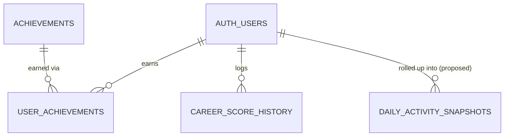

**Shipped**

| Table | Key columns | Notes |
|---|---|---|
| skills | slug, name, icon | public-read catalog |
| achievements / user_achievements | slug; user_id+achievement_id unique | append-only earn log |
| career_score_history | overall_score, resume_quality, technical_skills, interview_readiness, learning_progress, project_portfolio, job_readiness | only resume_quality is actually computed today; the other 5 are permanently stubbed pending the AI Context Engine |

**🟡 Proposed**

- `daily_activity_snapshots` — id, user_id, activity_date (unique per
  user/date), minutes_learned, questions_practiced,
  lessons_completed, streak_day bool.
- `admin_platform_metrics` — one row per day: dau, wau, mau,
  new_signups, total_users. Admin-only, not RLS-readable by regular
  users.

---

## 🟢🟡 Admin & CMS (core shipped, RBAC proposed)

`admin_users.role` is a flat checked string today — fine at current
scale, but requires a migration to add a role. The proposed tables below
normalize role → permission as data.

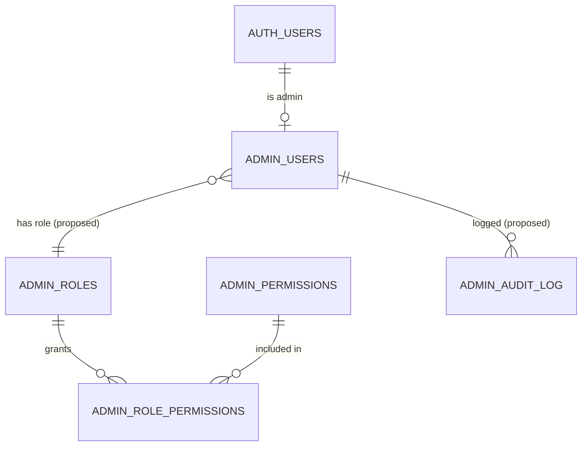

**🟡 Proposed**

| Table | Key columns | Notes |
|---|---|---|
| admin_roles | slug, name, description | catalog — replaces the check-constraint enum |
| admin_permissions | slug, name, description | e.g. manage_courses, manage_users, view_billing, manage_admins |
| admin_role_permissions | role_id, permission_id | N:N join |
| admin_audit_log | admin_user_id, action, target_table, target_id, before jsonb, after jsonb | append-only, service-role write only |

Migration path: additive, not a rewrite — add `admin_users.role_id`
alongside the existing `role` text column, backfill, cut application
code over, drop the old column in a later migration.

---

## 🟡 Notifications — proposed, fully new

No notification table exists anywhere in the schema today.

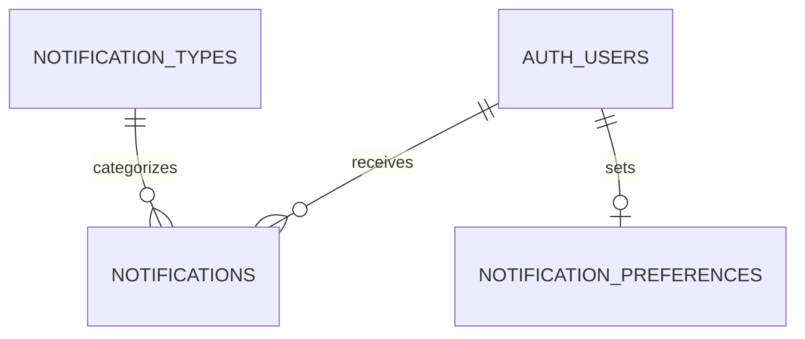

**notification_types** (public-read catalog)

| Column | Type | Notes |
|---|---|---|
| id (PK) | uuid | |
| slug | text | e.g. interview_reminder, job_match, streak_at_risk, application_status_changed |
| label, icon, default_channel | text | default_channel: in_app / email |

**notifications**

| Column | Type | Notes |
|---|---|---|
| id (PK) | uuid | |
| user_id, type_slug (FK) | uuid / text | → notification_types |
| title, body, action_url | text | |
| is_read, read_at | bool / timestamptz | |
| created_at | timestamptz | index (user_id, created_at desc) |

**notification_preferences** — 1:1: `user_id` PK, `channel_prefs jsonb`,
`muted_types text[]`.

RLS: `notification_types` public-read; `notifications` select own,
update own (mark read), delete own; `notification_preferences`
select+insert+update own.

---

## Relationships Catalog

| Cardinality | Examples |
|---|---|
| 1 : 1 | `auth.users ↔ profiles`, `auth.users ↔ user_subscriptions`, `auth.users ↔ ai_user_memory` |
| 1 : 1 (optional) | `auth.users ↔ admin_users` — not every user has a row |
| 1 : N | `courses → course_modules → lessons`, `resumes → resume_versions`, `interview_sets → interview_questions` |
| N : N (via join) | `practice_questions ↔ mock_tests` via `mock_test_questions`; `admin_roles ↔ admin_permissions` via `admin_role_permissions` (proposed) |
| Loose reference (no FK) | `jobs.role_slug ↔ interview_roles.slug` — intentionally not a hard FK |
| Parent-scoped, no user_id | `resume_versions` — RLS enforced via `exists()` against its parent `resumes` row |

---

## Database Standards

- **Primary keys** — `uuid primary key default gen_random_uuid()` on
  every table, no exceptions.
- **Timestamps** — `created_at timestamptz not null default now()` on
  every catalog and log table; `updated_at` added only where a row is
  mutated in place.
- **Soft vs. hard delete** — mixed by design: catalog/attempt history
  uses no delete at all; a handful of genuinely toggle-able user rows get
  a real delete RLS policy. Recommendation: introduce a shared
  `deleted_at timestamptz` convention only if a future domain needs
  "undo" — don't retrofit it onto tables with no such requirement today.
- **Naming** — snake_case throughout; table names are plural nouns; join
  tables are `a_b`; boolean columns read as a predicate.
- **Indexing strategy** — every own-row table is indexed `(user_id, …)`
  first; catalog hierarchy tables index `(parent_id, sort_order)`;
  status-filtered tables add `(user_id, status)` as a second index.
- **JSONB vs. normalized** — JSONB for a flexible, nobody-else-
  queries-into document; a normalized child table when many rows need to
  reference the shape independently.

## Security Model

Every table has RLS enabled. Three access patterns cover the entire
schema:

1. **Public-read catalog** — `for select using (true)`. Writes only via
   seed migrations or the service-role client.
2. **Own-row CRUD** — `using (auth.uid() = user_id)` on whichever of
   select/insert/update/delete the product actually needs — never all
   four by default.
3. **Zero-policy, service-role only** — RLS enabled with no policies at
   all. Used for anything with a "correct answer" or an internal cache.

Admin trust model: `admin_users` itself has only a select-own policy —
even an admin cannot grant themselves a higher role via the client. Every
API route calls `getServerSupabase()` then independently re-verifies
`auth.getUser()` before any mutation.

## Performance & Future Scalability

- **Time-based partitioning** — `ai_requests` and (once built)
  `daily_activity_snapshots` should partition by month once either
  exceeds a few million rows.
- **Materialize, don't re-aggregate** — the proposed
  `daily_activity_snapshots` nightly rollup turns an O(all-time-rows)
  dashboard query into an O(30-rows) one.
- **Caching layers already established** — `ai_response_cache` and
  `ai_user_memory` are the pattern to extend to any future expensive
  read.
- **Rate limiting stays Postgres-backed** — no Redis dependency
  introduced; revisit only if request volume makes a per-request count
  query itself a bottleneck.
- **Companies as a first-class entity** — add a public-read `companies`
  catalog and an additive, nullable `jobs.company_id` once postings are
  ingested from multiple sources.
- **RBAC and audit log before multi-admin growth** — ship the proposed
  Admin & CMS tables before adding a fourth admin role or a second
  content-management workflow.

---

ReSee Database Architecture — compiled from `website/supabase/migrations/0001`
through `0012b` (19 files). Documentation only; no migration was written or
run to produce this page.
