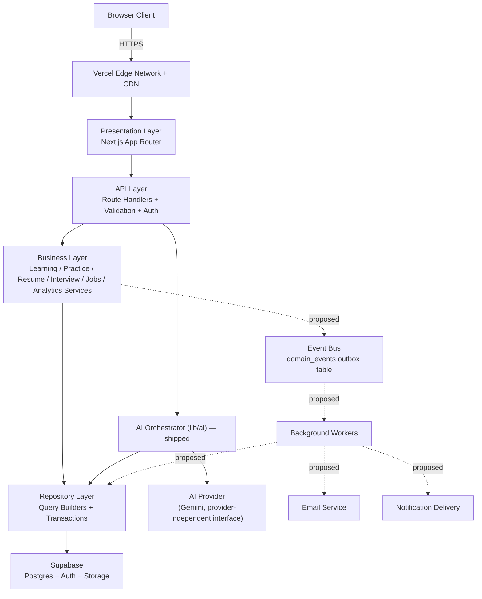
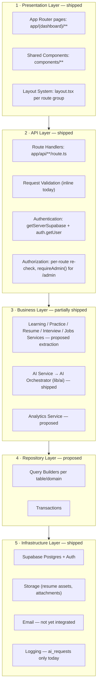
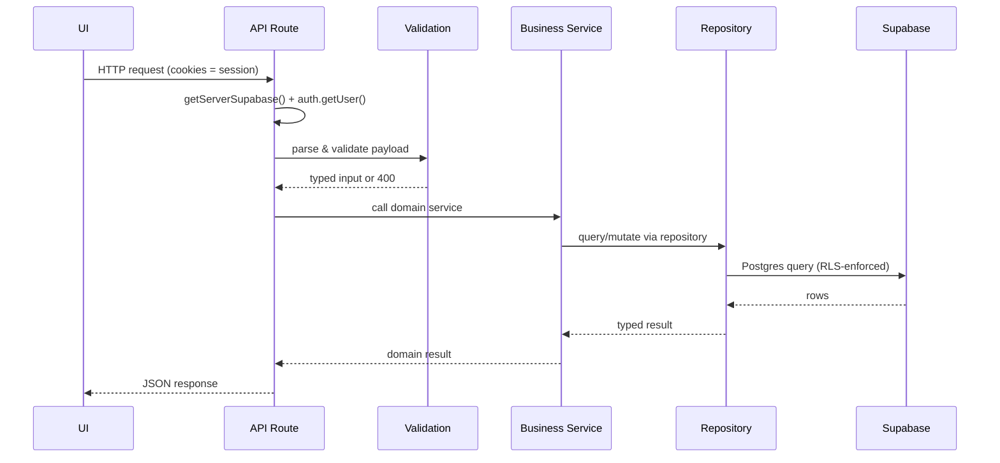
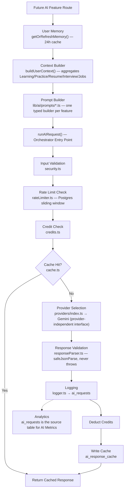
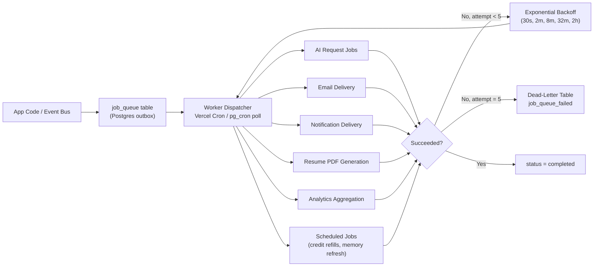
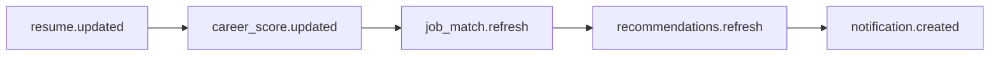

# ReSee — Enterprise System Architecture

How every layer of ReSee communicates today, and the target design for
scaling to millions of users. Builds directly on
`docs/architecture/database-architecture.md` and
`docs/architecture/ai-architecture.md` — this is the layer that sits above
both.

**Status legend:** 🟢 Shipped in production · 🟡 Proposed extension

---

## Reality Check — What's Shipped vs. Proposed

- **① Presentation — 🟢 shipped.** Full App Router structure under
  `app/(dashboard)/**`, ~40 shared hooks, feature-organized
  `components/**`.
- **② API — 🟢 shipped.** Every route under `app/api/**` follows one
  convention: `getServerSupabase()` → `auth.getUser()` → 401 JSON →
  query → response. No shared validation middleware yet — each route
  validates inline.
- **③ Business — collapsed into API + lib/.** No `services/` folder
  exists. Business rules live inline in route handlers, plus a handful of
  pure-logic `lib/*.ts` files (`careerScore.ts`, `progressAggregation.ts`,
  `resumeVersioning.ts`). The one domain with a real, separate
  orchestration layer is AI — `lib/ai/**`, built and working.
- **④ Repository — collapsed into API + lib/.** No query-builder
  abstraction exists. Every route calls the Supabase client directly. A
  deliberate simplicity choice at current scale, not an oversight.
- **⑤ Infrastructure — 🟢 shipped.** Supabase (Postgres + Auth +
  Storage), Vercel hosting/CDN. No queue, no cache layer beyond
  `ai_response_cache`, no error-tracking service, no email service wired
  up yet.

Background Processing, Event-Driven Architecture, formal Observability,
and the Business/Repository layer split are **proposed target designs**
in this document — greenfield, not refactors of something broken.

---

## High-Level Architecture

Every inbound request crosses the same spine. The AI Orchestrator and
(proposed) Event Bus / Workers are lateral systems the spine calls into,
not separate request paths.

## Layered Architecture

Today, L3 and L4 are the *same file* as L2 for every domain except AI.
The proposed extraction (see Folder Structure in
`docs/README.md`'s repository structure) splits them without moving
L1/L2/L5, which stay as-is.

---

## Request Flow

Canonical target flow, matching the brief exactly:

**Today**, Validation/Service/Repository collapse into the route handler
itself — e.g. `app/api/learning/courses/route.ts` validates the user
inline, queries `courses`/`enrollments`/`lesson_progress` directly, and
shapes the response in one function.

| Module | Real entry points today | Proposed Service | Proposed Repository | Core tables touched |
|---|---|---|---|---|
| Learning | app/api/learning/** | LearningService | CourseRepository, ProgressRepository | courses, lessons, enrollments, lesson_progress, quiz_attempts |
| Practice | app/api/practice/** | PracticeService | PracticeRepository, AttemptRepository | practice_topics, practice_attempts, mock_test_attempts |
| Resume | app/api/resumes/** | ResumeService | ResumeRepository | resumes, resume_versions |
| Interview | app/api/interviews/** | InterviewService | InterviewRepository | interview_sets, interview_questions, interview_attempts |
| Jobs | app/api/jobs/** | JobsService | JobsRepository | jobs, saved_jobs, job_applications, job_preferences |
| AI | — (no route calls it yet) | AIService (thin wrapper) | `lib/ai/requestManager.ts` already is the orchestrator | ai_requests, ai_response_cache, ai_user_memory, user_subscriptions |
| Analytics | app/api/progress/** | AnalyticsService | AnalyticsRepository | career_score_history, achievements, (proposed) daily_activity_snapshots |

---

## AI Orchestrator — 🟢 shipped (`lib/ai/**`)

This is the one business-layer domain already fully extracted.
`runAIRequest()` in `lib/ai/requestManager.ts` is the single entry point
every future AI feature calls — nothing in the running app calls it yet,
but the pipeline itself is real, working code, not a design sketch. Full
detail in `docs/architecture/ai-architecture.md`.

**Provider independence:** every adapter implements the `AIProvider`
interface (`providers/types.ts`); Gemini is the only one implemented
today because it's the only SDK this codebase has proven in production —
adding OpenAI/Anthropic later is a new file, zero changes to
`requestManager.ts`.

---

## Background Processing — 🟡 proposed, fully new

Nothing in this codebase runs outside a request today — no queue, no
cron, no worker process. Given the existing Postgres-only infrastructure
philosophy (rate limiting and caching are both Postgres-backed rather
than Redis), the proposed design uses a **transactional outbox** pattern
rather than introducing a new message broker.

**job_queue** (proposed table)

| Column | Type | Notes |
|---|---|---|
| id | uuid | PK |
| job_type | text | ai_request / email / notification / resume_pdf / analytics_rollup / scheduled |
| payload | jsonb | job-specific arguments |
| status | text | pending / processing / completed / failed |
| attempts, max_attempts | int | default max 5 |
| run_after | timestamptz | backoff scheduling |
| last_error | text | for the dead-letter table / debugging |

- **Resume PDF generation** is currently client-side (`jspdf` in the
  browser). Moving it to a worker only matters once server-rendered/
  queued export is a real feature.
- **Retry strategy:** exponential backoff via `run_after`, capped at 5
  attempts, then dead-lettered for manual/alerted review — mirrors the
  retry-on-429/5xx pattern already proven in `lib/ai/providers/gemini.ts`.
- **Failure handling:** a failed job never blocks its triggering request
  — the outbox row is written in the same transaction as the domain
  change.

---

## Event-Driven Architecture — 🟡 proposed, fully new

An internal `domain_events` table (the same outbox row that feeds
`job_queue`) recording what happened, so downstream consumers react
without the originating service knowing who's listening.

| Event | Emitted by | Consumers → side effects |
|---|---|---|
| learning.lesson_completed | LearningService | streak update, career_score.learning_progress recompute, achievement check |
| practice.attempt_completed | PracticeService | career_score.technical_skills recompute, weak-topic recommendation refresh |
| interview.attempt_completed | InterviewService | career_score.interview_readiness recompute, notification.created (summary ready) |
| jobs.application_submitted | JobsService | notification.created (confirmation), analytics event log |
| jobs.application_status_changed | JobsService | notification.created (status update) |
| subscription.changed | AI credits/billing flow | user_subscriptions refresh, notification.created (plan change) |

**Mechanism:** a service writes its domain change and a `domain_events`
row in the same Postgres transaction (transactional outbox — no dual-
write inconsistency). The worker dispatcher polls `domain_events`, fans
each event out to its registered consumers, and enqueues any resulting
`job_queue` rows.

---

## Security

- **JWT Flow — 🟢 shipped.** Supabase Auth issues a JWT on login, stored
  as an httpOnly cookie via `@supabase/ssr`. `website/proxy.ts` reads it
  on every matched route, calls `auth.getUser()` to verify server-side,
  and redirects unauthenticated requests to `/login` (or `/admin/login`)
  before the route even renders.
- **Row Level Security — 🟢 shipped.** Full catalog in
  `docs/architecture/database-architecture.md`.
- **API Authorization — 🟢 shipped.** Every route independently
  re-verifies `auth.getUser()` even though `proxy.ts` already redirected
  unauthenticated page loads — a direct API call bypasses the proxy layer
  entirely. Admin routes additionally call `requireAdmin()`
  (`lib/adminAuth.ts`).
- **Rate Limiting — 🟢 shipped for AI, 🟡 proposed app-wide.**
  `lib/ai/rateLimiter.ts` is a real, working Postgres sliding-window
  limiter (10 req/60s per user per feature), scoped to AI only today.
  Recommendation: extend the identical pattern to auth endpoints and any
  future public-write endpoint.
- **Audit Logging — 🟡 proposed.** No audit trail exists today beyond
  RLS itself. See the proposed `admin_audit_log` table in the Database
  Architecture doc.
- **Input Validation — ad hoc today, 🟡 proposed schema layer.** No
  schema-validation library is installed (no Zod, no Yup) — every route
  hand-checks its payload inline. Recommendation: introduce Zod schemas
  per route, colocated with each route (`route.schema.ts`).

## Observability — mostly proposed

| Category | Status |
|---|---|
| Structured Logging | 🟡 Proposed — today: `console.error` per route, unstructured |
| Error Tracking | 🟡 Proposed — no error-tracking service integrated |
| Performance Monitoring | 🟡 Proposed — Vercel's Web Vitals covers page-level; no API-route latency dashboard yet |
| API Metrics | 🟡 Proposed — no per-route request-count/error-rate table exists |
| AI Metrics | 🟢 Shipped — `ai_requests` already carries feature, provider, model, status, token counts, and latency per call |

## Scalability

| Tier | Focus |
|---|---|
| **100K users** | Current architecture handles this with no structural change. Add route-segment caching/ISR for public catalog pages. Vercel serverless auto-scales per request. Supabase connection pooling (Supavisor) enabled. |
| **1 million users** | Introduce `daily_activity_snapshots` rollup. Introduce the Background Worker queue. Add a shared edge/KV cache in front of catalog reads. Read replicas for read-heavy catalog queries. |
| **10 million users** | Time-partition `ai_requests`, `domain_events`, and activity-log tables by month. Move AI provider calls to a dedicated worker pool. CDN-cache every public catalog page fully, invalidated from the event bus. Consider splitting Postgres by domain only if write throughput becomes the bottleneck — not before, since cross-domain joins (e.g. the AI Context Engine) get materially harder once split. |

---

## Best Practices

- **Extract, don't rewrite** — every proposal here (services,
  repositories, event bus, workers) is additive to the current file
  layout.
- **One orchestrator per cross-cutting concern** — AI has
  `requestManager.ts`. Background Workers and the Event Bus should get
  the same single-entry-point discipline.
- **Postgres-first, add infra only when proven necessary** — introduce
  Redis/a message broker only when a measured bottleneck demands it.
- **RLS is the floor, not the whole wall** — keep adding layer-
  appropriate checks (route re-checks, `requireAdmin()`, future Zod
  validation) rather than relying on RLS to do everything.
- **Metrics table shape, once, everywhere** — `ai_requests`' shape is
  the proven template for any future metrics table.
- **Ship RBAC + audit log before the second admin workflow.**

---

ReSee Enterprise System Architecture — companion to
`docs/architecture/database-architecture.md` and
`docs/architecture/ai-architecture.md`. Documentation only; no code,
migration, or configuration was changed to produce this page.
