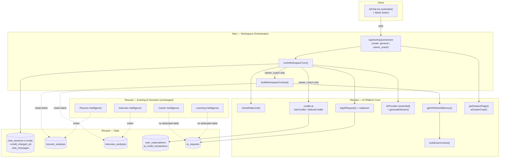
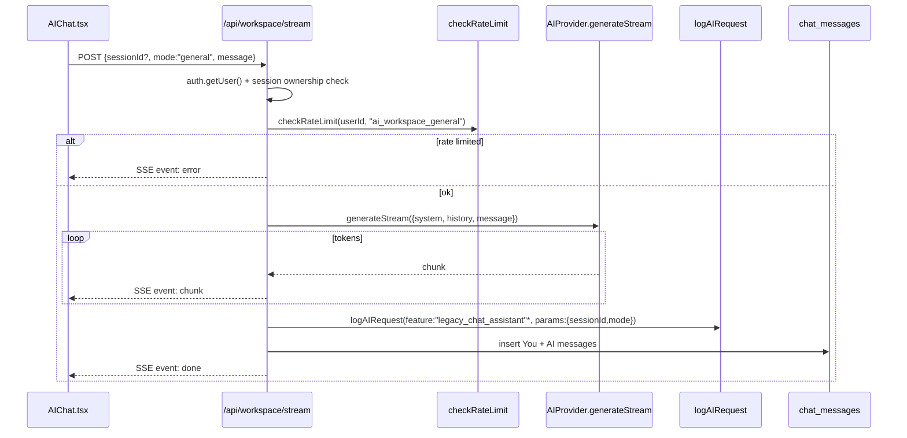
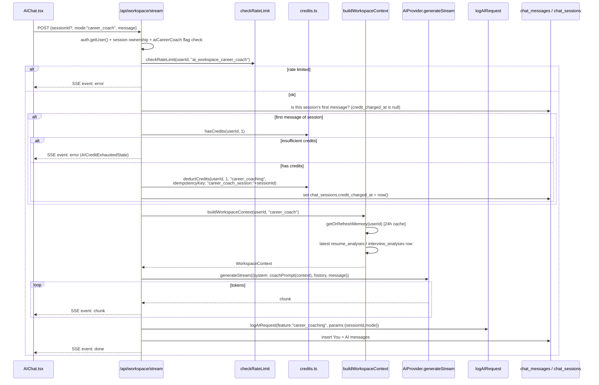
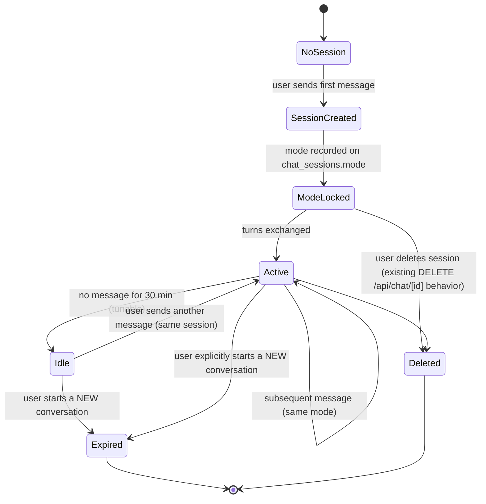
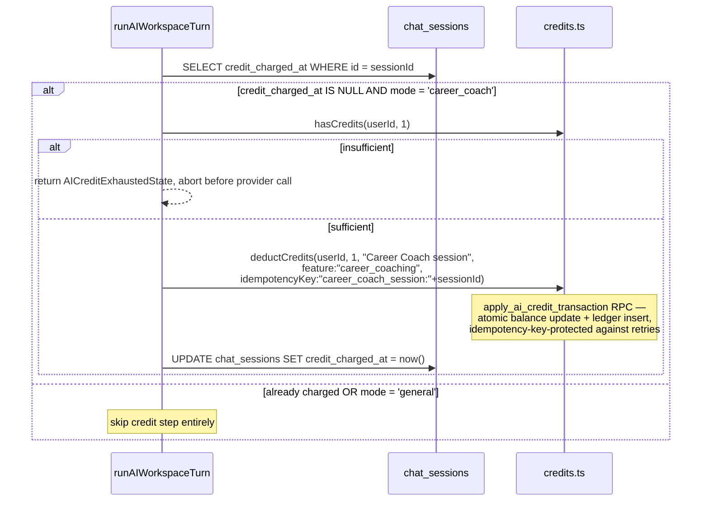

# ReSee AI Workspace — Architecture & UX Design Sprint

This document designs the unified AI Workspace — the single conversational
surface hosting **General Assistant mode** and **Career Coach mode** — as
specified in `docs/product/ai-product-specification.md` Decision 6. It
treats every existing AI system as the source of truth and asks, for every
new requirement, "what already does this, and how do we extend it?" before
proposing anything new.

---

## 0. Audit Summary — What Exists Today

Condensed from a full live-codebase audit (file:line references throughout
the rest of this document; see the four audit passes this sprint ran for
raw detail). Nothing below is aspirational — everything in this table is
real, working code.

| System                  | Status                                                                                                                                                                                                                                                                | Key file(s)                                                                                                                                         |
| ----------------------- | --------------------------------------------------------------------------------------------------------------------------------------------------------------------------------------------------------------------------------------------------------------------- | --------------------------------------------------------------------------------------------------------------------------------------------------- |
| General Chat Assistant  | **Live, but architecturally isolated.** `/api/chat/stream` streams via a hand-rolled SSE contract using its own `GoogleGenAI` client — never touches `runAIRequest`, credits, or caching. `/api/chat` is orphaned (zero callers).                                     | `app/api/chat/{route,stream/route}.ts`, `components/AIChat.tsx`                                                                                     |
| Chat Sessions / History | **Live**, RLS-correct since migration 0017. `chat_sessions`, `chat_messages`, `chat_history` (latter used only by the orphaned route).                                                                                                                                | `supabase/migrations/0017_chat_tables_baseline.sql`                                                                                                 |
| AI Request Pipeline     | **`runAIRequest()` is production-grade and fully wired** into 9 of 9 typed features (Resume/Career/Interview/Learning Intelligence). **`runLegacyAIRequest()`** serves the 8 legacy freeform routes. Neither supports streaming.                                      | `lib/ai/requestManager.ts`, `lib/ai/legacyRequest.ts`                                                                                               |
| User Context Engine     | **Live and reused everywhere** except chat. `buildUserContext()` — 10+ call sites. `getOrRefreshMemory()` (24h-cached snapshot) — **built, zero callers**, dead code.                                                                                                 | `lib/ai/userContext.ts`, `lib/ai/memory.ts`                                                                                                         |
| Resume Intelligence     | **Live.** Dedicated `resume_analyses` history table, full UI, PDF export.                                                                                                                                                                                             | `app/api/resumes/[id]/{analyze,rewrite,bullet-improvement}/route.ts`                                                                                |
| Career Intelligence     | **Live.** No dedicated history table — relies on `ai_response_cache`/`ai_requests` only; no user-facing history browse exists for this domain.                                                                                                                        | `app/api/jobs/[jobSlug]/match`, `app/api/progress/{skill-gap,roadmap}`, `app/api/learning/recommendation`, `app/api/dashboard/daily-recommendation` |
| Interview Intelligence  | **Live.** Dedicated `interview_analyses` table (mirrors `resume_analyses`), automatic + on-demand generation.                                                                                                                                                         | `lib/interviewEvaluation.ts`, `supabase/migrations/0021_interview_intelligence.sql`                                                                 |
| Learning module         | **Live**, two-layer (rule-based baseline always free + optional AI layer, silent-fallback error handling per Decision 10).                                                                                                                                            | `lib/learningRecommendation.ts`, `app/api/learning/recommendation/route.ts`                                                                         |
| Credit system           | **Live, transactional, idempotent.** Two Postgres RPCs (`apply_ai_credit_transaction`, `ensure_subscription_period`) fully cover atomicity + lazy monthly reset.                                                                                                      | `lib/ai/credits.ts`, `supabase/migrations/0019_ai_credit_integrity.sql`                                                                             |
| Feature flags           | **Live**, DB-backed with static-config fallback, 9 flags today, admin-toggleable.                                                                                                                                                                                     | `lib/ai/featureFlags.ts`, `feature_flags` table                                                                                                     |
| AI history              | **Live** self-service deletion across 7 tables; PII redaction is real and wired into every orchestrated call — **but chat message text itself never flows through `redactSensitiveFields()`**, because chat only logs `{sessionId}` as its `params`, not the message. | `app/api/settings/privacy/ai-history/route.ts`                                                                                                      |
| Admin AI Dashboard      | **Live**, read-only usage/error/latency charts + one write path (feature-flag toggles). No credit-granting UI.                                                                                                                                                        | `app/admin/(panel)/ai/{page,requests/page,feature-flags/page}.tsx`                                                                                  |

**The one genuine infrastructure gap**: the `AIProvider` interface
(`lib/ai/providers/types.ts`) has **no streaming method** — only
`generate(): Promise<AIProviderResult>`. Every streaming call in the app
today bypasses the provider abstraction entirely and talks to
`GoogleGenAI.generateContentStream()` directly inside the route handler.
This is the one place the AI Workspace cannot simply reuse what exists — it
must extend the provider interface, not duplicate around it.

**Naming collision found**: `components/documents/AIWorkspace.tsx` already
exists — a small presentational component for the unrelated Documents
feature (summary/answer/quiz/interview text panels). It is not a route, not
a data model, and shares no logic with what this document designs. Flagged
under Migration Strategy (§8) as a pre-existing-name conflict to resolve
(rename), not a reason to avoid the name "AI Workspace" as the product
surface — that name is already locked by the approved product spec.

---

## 1. Architecture Document

### 1.1 The one-sentence architecture

**The AI Workspace is the existing chat system, given a `mode` and taught
to speak the same credit/context/logging language every other AI feature
already speaks — it is not a new system standing next to chat, it is chat
becoming a first-class citizen of the AI platform.**

### 1.2 Guiding principle

Every other AI domain (Resume, Career, Interview, Learning) was built the
same way: a thin route calls `runAIRequest()`, which does validation, rate
limiting, credit checks, caching, provider calls, logging, and credit
deduction, in that order, for every feature, uniformly. Chat is the one
domain that never joined that pattern — it predates the orchestrator and
was hardened for _security_ (auth, RLS ownership) but never for
_platform consistency_ (credits, uniform logging, uniform rate-limit keys,
uniform provider abstraction).

The AI Workspace's job is to close exactly that gap for the two modes it
adds, while changing **zero** observable behavior for General Assistant
mode's existing users. Concretely:

- **General Assistant mode** = today's `/api/chat/stream` behavior,
  unchanged in every user-visible way (free, live-search-augmented,
  general-purpose), but now flowing through the same orchestrated pipeline
  every other feature uses.
- **Career Coach mode** = a new, `UserContext`-grounded, credit-metered
  mode added _alongside_ General mode in the same conversation UI, same
  session/history tables, same streaming transport.

### 1.3 Reusable components inventory (reuse, do not rebuild)

| Component                                                                                         | Reused for                                                               | Adaptation needed                                                                                                                                                                     |
| ------------------------------------------------------------------------------------------------- | ------------------------------------------------------------------------ | ------------------------------------------------------------------------------------------------------------------------------------------------------------------------------------- |
| `chat_sessions` / `chat_messages` tables                                                          | Session + message storage for both modes                                 | Add `mode` and `credit_charged_at` columns (§8)                                                                                                                                       |
| SSE contract (`event: session/chunk/error/done`) already proven in `app/api/chat/stream/route.ts` | Streaming transport for both modes                                       | None — this contract is sound and already handles the client's known `res.body`-without-`res.ok`-check quirk                                                                          |
| `checkRateLimit()`                                                                                | Per-mode rate limiting                                                   | Split into two feature keys instead of one shared `"legacy_chat_assistant"` key (§7 — this is a real existing bug worth fixing)                                                       |
| `lib/ai/credits.ts` (`hasCredits`/`deductCredits`, idempotency-key mechanism)                     | Session-based Career Coach billing                                       | New idempotency-key convention: `career_coach_session:<sessionId>` (§6)                                                                                                               |
| `getFeatureFlags()` / `useFeatureFlag()`                                                          | Gating Career Coach mode                                                 | One new flag, `aiCareerCoach` (§1.5)                                                                                                                                                  |
| `buildUserContext()` / `getOrRefreshMemory()`                                                     | Career Coach grounding                                                   | `getOrRefreshMemory` finally gets its first real caller — its 24h staleness cache is exactly what a multi-turn conversation needs to avoid re-aggregating 10+ tables on every message |
| `resume_analyses` / `interview_analyses` tables                                                   | Enriching Career Coach's grounding with "what AI already told this user" | Read-only additive queries — no schema change (§5)                                                                                                                                    |
| `logAIRequest()` + `toRedactedParams()`                                                           | Uniform logging for both modes                                           | Continue the chat convention of logging `{sessionId, mode}`, never message text (§7)                                                                                                  |
| `AIDisclosureBadge`, `AIErrorState`, `AICreditExhaustedState`, `AILoadingState`                   | Workspace UI                                                             | Direct reuse, zero changes                                                                                                                                                            |
| `app/api/settings/privacy/ai-history/route.ts`                                                    | AI history deletion                                                      | Already deletes `chat_sessions`/`chat_messages` — **no change needed**, the Workspace's data lives in tables this route already purges                                                |
| Admin AI Dashboard (`ai_requests`-driven stats)                                                   | Workspace observability                                                  | Already generic over `feature` — `career_coaching` request volume appears automatically once logged; no admin code change required                                                    |
| `AIProvider` interface (`lib/ai/providers/types.ts`)                                              | Model abstraction                                                        | **Extended**, not duplicated — add a streaming method (§1.4)                                                                                                                          |

### 1.4 What's genuinely new

1. **A streaming-capable orchestrator.** `runAIRequest()` cannot be reused
   as-is (it awaits a complete, parseable JSON result). A new function —
   `runAIWorkspaceTurn()` — is needed, performing the _same_ pipeline
   (validate → rate-limit → credit-check → context-build → provider call →
   log → deduct) but yielding a stream of text chunks instead of a parsed
   object. This is additive to `lib/ai/requestManager.ts`, not a fork of
   it — both functions share the same validation/rate-limit/credit/log
   helper calls underneath.
2. **A streaming method on `AIProvider`.** `generateStream(request):
AsyncIterable<string>` (or equivalent), implemented once in
   `GeminiProvider` by moving the existing ad hoc
   `ai.models.generateContentStream()` call (currently duplicated in
   `app/api/chat/stream/route.ts`) _into_ the adapter. This is the single
   most important structural fix in this design: streaming becomes a
   provider capability like `generate()` already is, not a per-route
   escape hatch. It is also the concrete enabler of Decision 1's "future
   model selection" and §1.6's "future multi-provider support" — any new
   adapter must implement both methods.
3. **A `WorkspaceContext` composition function.** `buildWorkspaceContext
(userId, mode)` — for `general` mode, returns nothing (preserves
   today's zero-grounding behavior exactly). For `career_coach` mode,
   calls `getOrRefreshMemory(userId)` for the base `UserContext` snapshot,
   then additively fetches the latest `resume_analyses` and
   `interview_analyses` rows (1 query each, `limit 1`, ordered
   `created_at desc`) to build a small "Intelligence Digest" the Coach can
   reference ("your last resume analysis scored 72/100"). This is a new,
   thin composition function — it does not modify `UserContext` itself
   (zero risk to the 10 existing `buildUserContext()` callers) and does
   not add new tables (both source tables already exist).
4. **A conversational system-prompt builder for Career Coach mode.** The
   existing `lib/ai/prompts/careerCoaching.ts` (`buildCareerCoachingPrompt`)
   was built for v1.0's superseded single-turn, strict-JSON design (`{
reply, suggestedActions }`) — Decision 6 explicitly changed this to a
   free-flowing, multi-turn, streamed conversation. The identity/grounding
   _content_ of that prompt (the persona instruction, the
   `formatContextBlock()` call) is reused; the strict-JSON output contract
   is not, since a streamed conversational reply cannot be a single parsed
   JSON object. This is a genuinely new prompt builder,
   `buildCareerCoachSystemPrompt()`, sharing the grounding-data assembly
   pattern with the old one but not its output format.
5. **A mode switch UI element** in the chat surface, and **session-start
   credit-cost disclosure** ("this session uses 1 credit") for Career
   Coach mode, per the product spec's explicit UX requirement (§2 Domain
   E.3).

### 1.5 Feature flag decision

One new flag: **`aiCareerCoach`** (mirrors the existing naming convention:
`aiResumeAnalysis`, `aiJobMatch`, etc.). It gates **only** the Career Coach
mode switch and its server route. General Assistant mode remains
permanently unflagged, matching Decision 1 ("every feature always
available") and preserving its current live, already-shipped status — the
Workspace redesign must never be the reason General mode's existing users
see a flag-gated regression.

### 1.6 Scaling considerations

- Adding a credit-check + context-build step before the stream starts
  adds one Postgres round trip (credit check) plus, for Career Coach mode
  only, a memory-cache read (`ai_user_memory`, usually a cache hit given
  `getOrRefreshMemory`'s 24h staleness window) — both negligible next to
  Gemini's own time-to-first-token.
- Session-scoped credit charging (once per session, not per message)
  means Career Coach's cost profile scales with _conversations_, not
  _turns_ — a chatty session costs the same 1 credit as a two-message one,
  which is also why `getOrRefreshMemory`'s cache matters: without it, a
  10-message session would otherwise re-run `buildUserContext()`'s 10+
  table fan-out on every single turn.
- The hand-rolled SSE approach already handles the app's current chat
  volume; nothing about adding a second mode changes its scaling
  characteristics — it's the same transport carrying one more type of
  turn.

### 1.7 Future extension points

- **Multi-provider**: once `AIProvider` gains `generateStream()`, a second
  adapter (OpenAI, Anthropic) implementing both methods can be swapped in
  via the existing `getProvider()` factory with zero caller changes —
  exactly the seam §1.6 of the product spec already promises.
- **Model tiering (Pro/Enterprise "stronger model")**: `AIProviderRequest.
model` already exists as an override seam; `runAIWorkspaceTurn()` can
  consult plan tier and pass a model override the same way any future
  Phase-8 tiering work would for non-streaming features — no new seam
  needed.
- **Additional modes**: if a third mode is ever proposed (e.g. an
  interview-prep-specific coach), it slots in as a third `mode` enum value
  plus its own system-prompt builder and its own credit-cost row in
  `docs/product/ai-product-specification.md §1.2` — the session/streaming/
  credit machinery designed here is already mode-agnostic.
- **Tool-calling / function-calling**: not in scope for this phase, but
  the `WorkspaceContext` composition function (§1.4.3) is the natural
  place to later add a "fetch live data on demand" capability (e.g. "check
  my latest practice score") without restructuring the conversation
  pipeline itself.

---

## 2. Component Diagram



---

## 3. Request Flow

Two flows, since the two modes genuinely differ in what happens before the
first token streams.

### 3.1 General Assistant mode (must be behaviorally identical to today)



*Feature slug for General mode logging is a decision item — see §9, Phase
6b: either keep `legacy_chat_assistant` for continuity with existing
`ai_requests` history, or introduce `ai_workspace_general` and treat the
rename as a clean break. No credit check, no context build — identical
cost/behavior profile to today's `/api/chat/stream`.

### 3.2 Career Coach mode (new)



Note the credit check happens **before** context is built and **before**
the provider is called — mirroring `runAIRequest()`'s existing order
(validate → rate-limit → credits → ... → provider), so a Coach-mode
session never pays the cost of context assembly or a model call if the
user has no credits left.

---

## 4. Conversation Lifecycle

### 4.1 Lifecycle state machine



### 4.2 Key lifecycle decision: mode is fixed per session

The product spec allows "a mode switch" but leaves session boundaries a
tuning detail. This design makes an explicit, minimal-complexity call:
**mode is set once, at session creation, and cannot change mid-session.**
Switching modes always starts a new session (a new `chat_sessions` row).

Rationale: Career Coach billing is session-scoped ("1 credit per session,
not per message" — Decision 2). If mode could change mid-session, "when is
a session's first Career-Coach message" becomes ambiguous (a session that
starts in General mode and switches to Coach mode mid-conversation — does
the switch itself trigger a charge? does prior General-mode history count
as context?). Fixing mode per session removes the ambiguity entirely at
zero product cost — the UX flow below shows this is not a limitation
users will notice, since "start a new conversation" is already the natural
action when changing what you want to talk about.

### 4.3 Session-boundary timeout

**Proposed default: 30 minutes of inactivity** closes a session for
_new automatic context reuse_ purposes (a stale session becomes `Idle`,
not deleted — the user can still resume it, per the state diagram; the
timeout only governs whether re-entering it should be treated as
"continuing" for UX framing, e.g. whether to show "Resume where you left
off" vs starting fresh). This is a tuning parameter, not a hard
architectural constraint — implementable as a simple `now() -
last_message_at > interval '30 minutes'` check computed from
`chat_messages.created_at`, no new column needed. Exact value is explicitly
called out as configurable at implementation time, matching the product
spec's own framing ("exact timeout is a tuning parameter").

### 4.4 UX flows

**Flow A — First-time General Assistant use (unchanged from today):**

1. User opens `/chat` → sees existing sessions list (empty if new) →
   types a message → session created with `mode='general'` (default) →
   streams a reply exactly as today.

**Flow B — Starting a Career Coach session:**

1. User clicks the mode switch (e.g. a segmented control: "General
   Assistant" / "Career Coach") _before_ sending a message.
2. UI shows a one-line disclosure: "This session uses 1 credit." (Decision
   4-style persistent disclosure, not a blocking modal.)
3. User sends the first message → session created with
   `mode='career_coach'` → credit charged (idempotent) →
   `buildWorkspaceContext()` runs → streamed, context-grounded reply.
4. Subsequent messages in the same session stream with no further charge
   and no further credit-check latency (only the rate limiter runs).

**Flow C — Out of credits:**

1. User in Career Coach mode, first message of a new session, 0 credits
   remaining → `AICreditExhaustedState` renders in place of a reply (same
   shared component every other feature already uses) → General Assistant
   mode remains fully usable in parallel (unmetered, unaffected).

**Flow D — Mid-session provider failure:**

1. Credit already charged (session-scoped) → provider call fails →
   standard `AIErrorState` retry affordance appears **within the same
   session** → retry does not re-charge (idempotency key is
   session-scoped, not per-attempt) — matches the product spec's explicit
   fallback requirement (§1.2, Career Coach section: "a failure mid-session
   doesn't consume a new credit").

**Flow E — Switching modes:**

1. User in an active Career Coach session wants to ask something general →
   clicks "New Conversation" → picks General Assistant mode → a fresh
   session starts. The old Career Coach session remains in the session
   list, fully readable, unaffected.

---

## 5. Context Lifecycle

```mermaid
flowchart LR
    A["Turn arrives<br/>(career_coach mode)"] --> B{"getOrRefreshMemory(userId)"}
    B -->|"cache fresh (<24h)"| C["Return cached UserContext snapshot<br/>(1 row read, ai_user_memory)"]
    B -->|"cache stale/missing"| D["buildUserContext(userId)<br/>(10+ table fan-out, as today)"]
    D --> E["Upsert ai_user_memory"]
    E --> C
    C --> F["+ latest resume_analyses row (1 query)"]
    F --> G["+ latest interview_analyses row (1 query)"]
    G --> H["WorkspaceContext assembled"]
    H --> I["formatContextBlock() — same data-minimization\ndiscipline every other prompt builder uses"]
    I --> J["Injected into system prompt for this turn only"]
    J --> K["Never persisted raw — only the assembled\nWorkspaceContext's non-identifying shape\nflows into the prompt, never logged"]
```



**Context is per-turn, not per-session-cached in memory beyond the
existing 24h `ai_user_memory` TTL.** Each Career Coach turn re-runs
`getOrRefreshMemory()` — cheap when fresh (one row read), correctly
refreshing if the user's underlying data changed (e.g. completed a course
mid-conversation) once the 24h window elapses. This deliberately reuses
the _existing_ staleness policy rather than inventing a session-scoped
context cache — one less cache invalidation problem to design.

**What "Resume/Career/Interview/Learning Intelligence integration" means
concretely**: not that the Coach calls those features' routes live during
a conversation (that would mean nested credit charges and unpredictable
latency), but that the Coach's grounding context is enriched with the
**most recent already-generated result** from Resume Intelligence
(`resume_analyses`) and Interview Intelligence (`interview_analyses`) —
data that already exists, at zero additional AI cost. Career Intelligence
and Learning Intelligence have no dedicated history table (§0), so their
integration is limited to what `UserContext` already carries (skills,
learning stats, practice stats) — this is an accurate, not aspirational,
integration boundary given the current data model, and is flagged as a
future extension point if per-user history tables are ever added for
those two domains.

**Conversation history itself** (prior turns in the same session) is read
directly from `chat_messages` — not part of `UserContext`, and not subject
to the 24h cache; it is always current, since it's the session's own
message log.

---

## 6. Credit Lifecycle



**Session-boundary billing, implemented with the same primitives every
other feature already uses**: no new RPC, no new table. The only new piece
is the `chat_sessions.credit_charged_at` column, which answers "has this
session already been billed?" in one indexed lookup (the session's own
primary key), backed by the idempotency-key mechanism already proven in
`apply_ai_credit_transaction` (Decision 8) as the actual source of truth
against double-charging — the column is a fast-path check, the
idempotency key is the correctness guarantee (if the column update ever
raced or failed, a retry would still hit the idempotency key and no-op).

**General Assistant mode never enters this flow at all** — the `mode =
'career_coach'` guard at the top means General mode's cost profile is
provably unchanged from today (zero credit calls, same as the current
`/api/chat/stream`).

**Monthly reset**: unaffected — `hasCredits`/`deductCredits` already call
through `ensureSubscriptionPeriod()` internally, so a Career Coach session
that happens to span a reset boundary is handled by infrastructure that
already exists and was verified during AI Phase 0.5.

---

## 7. Security Model

| Concern                            | Current state                                                                                                                                                               | Workspace design                                                                                                                                                                               |
| ---------------------------------- | --------------------------------------------------------------------------------------------------------------------------------------------------------------------------- | ---------------------------------------------------------------------------------------------------------------------------------------------------------------------------------------------- |
| Authentication                     | Every chat route already requires `getServerSupabase().auth.getUser()`, 401 otherwise                                                                                       | Unchanged — same pattern in the new `/api/workspace/stream` route                                                                                                                              |
| Session ownership                  | `chat_sessions`/`chat_messages` RLS enforces `auth.uid() = user_id` (directly or via the session join)                                                                      | Unchanged — `mode`/`credit_charged_at` are just additional columns on an already-correctly-scoped table, no new RLS policy needed                                                              |
| Rate limiting                      | **Bug found**: both existing chat routes share one rate-limit key, `"legacy_chat_assistant"` — a Career Coach user and a General Assistant user compete for the same budget | **Fixed in this design**: two distinct keys, `"ai_workspace_general"` and `"ai_workspace_career_coach"`, reusing `checkRateLimit()` unchanged — just called with mode-specific feature strings |
| Credit-exploit via retries         | Already mitigated platform-wide by Decision 8's idempotency-key mechanism                                                                                                   | Directly inherited — `career_coach_session:<sessionId>` is a stable, retry-safe key by construction                                                                                            |
| PII in logs                        | Chat already logs only `{sessionId}` as `params`, never message text; every orchestrated feature runs `params` through `toRedactedParams()` before logging                  | Preserved exactly — `runAIWorkspaceTurn()`'s `logAIRequest()` call logs `{sessionId, mode}` only, matching Decision 7's absolute rule (no raw user-generated content in `ai_requests`, ever)   |
| Prompt injection                   | Structural role separation (system/user) + `validatePromptInput()`'s length/heuristic guard already the platform's primary defense                                          | Unchanged — `runAIWorkspaceTurn()` calls `validatePromptInput()` on the incoming message exactly like every other feature does before it reaches the provider                                  |
| Cross-user data leakage in context | `buildUserContext()`/`getOrRefreshMemory()` are already scoped to a single `userId` parameter with no cross-user query paths                                                | Unchanged — `buildWorkspaceContext()` only ever takes the authenticated caller's own `userId`; the additive `resume_analyses`/`interview_analyses` reads are filtered the same way             |
| Feature-flag bypass                | Every other domain checks its flag server-side, not just client-side                                                                                                        | Career Coach mode's route must check `getFeatureFlags().aiCareerCoach` server-side before entering the credit/context/provider pipeline — mirrors every existing route's pattern exactly       |
| Data retention                     | 60-day `ai_requests` retention (metadata only), self-service AI-history deletion already covers `chat_sessions`/`chat_messages`                                             | Unchanged — no new retention surface; the Workspace's data lives entirely inside tables the existing deletion route and (future) purge job already cover                                       |

---

## 8. Migration Strategy

### 8.1 Schema changes (one new migration, additive only)

```sql
-- supabase/migrations/0022_ai_workspace.sql (illustrative — not applied by this sprint)
alter table public.chat_sessions
  add column if not exists mode text not null default 'general'
    check (mode in ('general', 'career_coach')),
  add column if not exists credit_charged_at timestamptz;
```

Every existing `chat_sessions` row gets `mode = 'general'` via the column
default — **zero backfill script needed, zero behavior change for any
existing conversation.** This is the same additive-migration discipline
used for `resume_analyses`/`interview_analyses` in prior phases: one new
column set, no destructive change, no data rewrite.

### 8.2 Route consolidation, done carefully

- **Do not rewrite `/api/chat/stream` in place on day one.** Stand up the
  new `/api/workspace/stream` route behind the `aiCareerCoach` flag (or a
  route-level flag if finer control is wanted), with General mode routed
  through it reproducing today's exact behavior. Verify parity (same
  system prompt, same live-search augmentation, same SSE contract) before
  cutting the client over.
- Once verified, `AIChat.tsx` points at the new route for both modes, and
  the old `/api/chat/stream` is deprecated (not deleted — kept until
  confirmed unused, per this project's established caution around
  destructive changes).
- **`/api/chat/route.ts`** — already confirmed orphaned (zero callers) by
  this sprint's audit. Recommend retiring it as part of this migration
  rather than carrying it forward into the Workspace's scope; it writes to
  `chat_history`, a table nothing else needs once this route is gone.
  This is a recommendation for the user to approve, not an action taken by
  this sprint.
- **`chat_history` table** — becomes fully unused once `/api/chat/route.ts`
  is retired. Left in place (schema removal is a separate, later decision)
  but excluded from any new code path.

### 8.3 Naming collision resolution

`components/documents/AIWorkspace.tsx` (Documents feature, unrelated)
should be renamed (e.g. `DocumentAIPanel.tsx`) before or alongside this
work to avoid two same-named-but-unrelated components in the codebase.
This is a pure rename with no behavior change — flagged here so it's not
discovered mid-implementation as a surprise naming conflict.

### 8.4 Compatibility guarantees

- Existing chat sessions/messages remain fully readable and deletable
  exactly as today (no RLS change, no column removal).
- General Assistant mode's cost (free), behavior (live-search, persona,
  streaming), and data flow (writes to `chat_messages` only, matching
  today's `stream/route.ts` — not `chat_history`) are preserved exactly.
- The AI-history deletion route needs **no code change** — it already
  deletes `chat_sessions`/`chat_messages` unconditionally by `user_id`,
  which covers both modes automatically.

---

## 9. Implementation Phases

Sequenced as sub-phases of the product spec's Phase 6, each independently
verifiable before the next begins — matching this project's established
phase discipline (audit → build → verify → report → approval gate).

| Sub-phase                                 | Scope                                                                                                                                                                                                                                                                                | Verifies                                                                                                                                                                                                                                                                     |
| ----------------------------------------- | ------------------------------------------------------------------------------------------------------------------------------------------------------------------------------------------------------------------------------------------------------------------------------------ | ---------------------------------------------------------------------------------------------------------------------------------------------------------------------------------------------------------------------------------------------------------------------------- |
| **6a — Foundation**                       | Migration 0022 (`mode`, `credit_charged_at` columns); `aiCareerCoach` feature flag row; extend `AIProvider` interface with `generateStream()`; implement it once in `GeminiProvider` by relocating the existing `generateContentStream()` call out of the route and into the adapter | tsc/lint clean; no behavior change yet (nothing calls the new method until 6b)                                                                                                                                                                                               |
| **6b — Orchestrator, General mode first** | Build `runAIWorkspaceTurn()`; stand up `/api/workspace/stream` with `mode:"general"` reproducing today's `/api/chat/stream` exactly (same prompt, same live-search, same SSE contract); route `AIChat.tsx` at the new endpoint behind a flag for internal testing only               | Byte-for-byte behavioral parity with today's General Assistant — the highest-risk regression surface, verified first and in isolation                                                                                                                                        |
| **6c — Career Coach mode**                | `buildWorkspaceContext()`; new `buildCareerCoachSystemPrompt()`; session-credit charging wired per §6; mode-aware route logic; `aiCareerCoach`-gated                                                                                                                                 | Live verification script (matching this project's `npx tsx --env-file` pattern): session creation charges exactly once across multiple messages and across a simulated retry; insufficient-credit path never reaches the provider; General mode sessions never touch credits |
| **6d — UI**                               | Mode switch control; session-start credit-cost disclosure; wire `AIDisclosureBadge`/`AIErrorState`/`AICreditExhaustedState` into the Workspace surface                                                                                                                               | Manual UX walkthrough of Flows A-E (§4.4)                                                                                                                                                                                                                                    |
| **6e — Cleanup & convergence**            | Retire `/api/chat/route.ts` (pending user approval per §8.2); remove the now-dead ad hoc `GoogleGenAI` instantiation from the old stream route once fully cut over; rename `components/documents/AIWorkspace.tsx` (§8.3)                                                             | `git status` scoped to exactly the files this phase touches; confirm zero remaining callers of anything retired                                                                                                                                                              |
| **6f — Observability confirmation**       | No new admin code expected (§1.3) — confirm `career_coaching` and the two new rate-limit-key requests appear correctly in the existing Admin AI Dashboard's "Requests by Feature" breakdown                                                                                          | Read-only check against `/admin/ai` post-rollout                                                                                                                                                                                                                             |

Each sub-phase closes with the same verification discipline used in every
prior AI phase: `tsc --noEmit`/lint clean, a scoped `git status` check, and
a live Supabase/dev-server check — no commits until the user explicitly
approves, per this project's standing constraint.

---

## 10. Risk Analysis

| Risk                                                                                                                                                   | Likelihood                                                                    | Impact                                                                                                                                                | Mitigation                                                                                                                                                                                                                                                                                                              |
| ------------------------------------------------------------------------------------------------------------------------------------------------------ | ----------------------------------------------------------------------------- | ----------------------------------------------------------------------------------------------------------------------------------------------------- | ----------------------------------------------------------------------------------------------------------------------------------------------------------------------------------------------------------------------------------------------------------------------------------------------------------------------- |
| Streaming credit-charge race — two tabs/requests send a session's "first message" simultaneously                                                       | Low-medium (double-tab usage is real but rare)                                | Double charge if unmitigated                                                                                                                          | `apply_ai_credit_transaction`'s idempotency key (`career_coach_session:<sessionId>`) makes the second concurrent charge a no-op (`replayed: true`) regardless of the `credit_charged_at` column's own race — the column is a fast-path optimization, the RPC is the correctness guarantee                               |
| General Assistant regression during migration                                                                                                          | Medium (any route rewrite risks behavior drift)                               | High (would break a widely-used, already-shipped feature)                                                                                             | Sub-phase 6b explicitly verifies parity in isolation before Career Coach mode is added; old route kept running in parallel until cutover is confirmed                                                                                                                                                                   |
| Context bloat increasing per-turn latency in long Career Coach conversations                                                                           | Low                                                                           | Medium (UX feels slower than General mode)                                                                                                            | `getOrRefreshMemory()`'s 24h cache means only the _first_ stale turn pays the full `buildUserContext()` cost; `formatContextBlock()`'s existing data-minimization discipline keeps the injected block itself small                                                                                                      |
| Mode-switch billing ambiguity if a future request loosens "mode fixed per session"                                                                     | Low now, real if revisited later                                              | Medium (unclear what triggers a charge)                                                                                                               | This design makes mode-per-session an explicit, documented constraint (§4.2) precisely to close this off; any future relaxation needs its own product decision, not a silent architecture drift                                                                                                                         |
| Two same-named-but-unrelated `AIWorkspace` symbols in the codebase                                                                                     | Certain if unaddressed                                                        | Low (developer confusion, not a runtime bug)                                                                                                          | Rename `components/documents/AIWorkspace.tsx` as part of 8.3/6e                                                                                                                                                                                                                                                         |
| Rate-limit key collision (existing bug: both chat routes share `"legacy_chat_assistant"`)                                                              | Already happening today                                                       | Low-medium (a Career Coach user's messages could exhaust the shared budget and rate-limit an unrelated General Assistant conversation, or vice versa) | Split into `"ai_workspace_general"` / `"ai_workspace_career_coach"` keys as part of 6b/6c — a genuine bug fix riding along with this migration, not scope creep, since the shared key stops making sense the moment two differently-priced modes exist                                                                  |
| `interview_analyses`/`resume_analyses` enrichment silently returns stale or missing data if a user has none yet                                        | Certain for new users                                                         | Low (Coach mode simply has less to reference — not an error state)                                                                                    | `buildWorkspaceContext()` treats an empty/absent latest-analysis row as an absent field, not a failure — the Coach prompt already only includes what's actually present via `formatContextBlock()`'s existing "skip undefined fields" convention                                                                        |
| Retired `/api/chat/route.ts` turns out to have an undiscovered caller (e.g. an external integration, a test script)                                    | Low (audit found zero references anywhere in the app)                         | Medium if wrong                                                                                                                                       | Recommendation only in this design (§8.2) — actual retirement requires explicit user approval and should keep the route disabled-but-present for one release before deletion, per this project's caution around destructive changes                                                                                     |
| Career Coach's new streaming prompt builder re-introduces a hallucination surface the old single-turn design's strict-JSON contract implicitly limited | Medium (free-flowing text has fewer structural guardrails than a JSON schema) | Medium (advice quality/trust)                                                                                                                         | The persistent `AIDisclosureBadge` (Decision 4) already covers this platform-wide; additionally, `formatContextBlock()`'s grounding data keeps replies anchored to real user data rather than invented specifics — no new mitigation invented here, existing platform guardrails already apply to conversational output |

---

## Summary

Every requirement in the AI Workspace's brief — General/Career Coach
modes, shared sessions, context-awareness, credit usage, feature flags,
streaming, future provider support — maps onto infrastructure that already
exists in production, with exactly one real gap: **the provider
abstraction has no streaming method today**, because chat predates the
orchestrator and was never migrated onto it. This design closes that one
gap, adds two narrow, additive schema columns, and otherwise composes
existing, proven primitives (credits, feature flags, context engine,
history tables, admin observability, AI history deletion) rather than
building parallel infrastructure next to them. The result is that
implementing this phase is mostly _wiring_, not _inventing_ — consistent
with every prior AI phase's actual execution profile once its design was
settled.

No production code, configuration, or migration has been changed to
produce this document.
